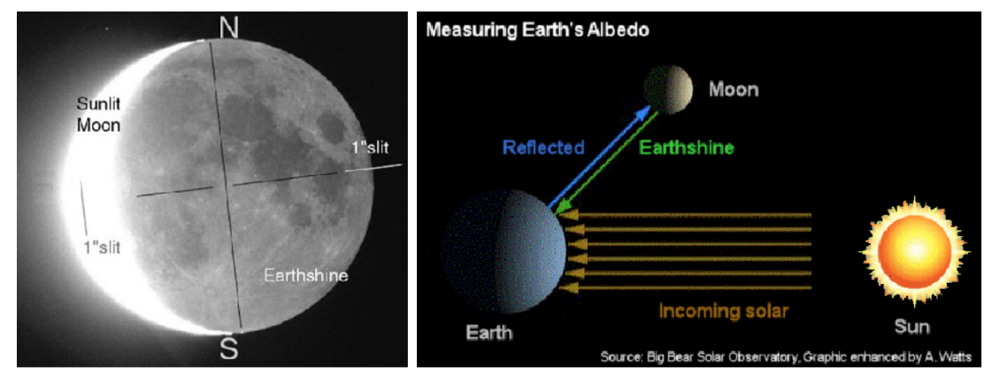

# Calculating the Spectra of Earthshine 

The detection of exolife is one of the most important goals for future space missions.

Current space missions used to identify exoplanets include COROT, Spitzer and the Hubble Space Telescope, as well as the secondary extended mission of Deep Impact (EPOCh) which will observe the light reflected from exoplanets. 

ESAs Darwin mission (estimated launch 2015) will aim to find and study the properties and composition of Earth-like exoplanets in the infrared. 

Over 300 giant exoplanets already have been detected, and hundreds, perhaps thousands more, are anticipated in the coming years. 

The nature of these planets, including their orbits, masses, sizes, constituents, and likelihood that life could develop on them, can be probed by a combination of observations and modeling.

In this repository I made available the IDL source code for data reduction and analysis, plus my results and reports.

----

## License

When making a reference to my work, please use my [website](http://bt3gl.github.io/index.html).
This work is licensed under a [Creative Commons Attribution-ShareAlike 4.0 International License](http://creativecommons.org/licenses/by-sa/4.0/).
